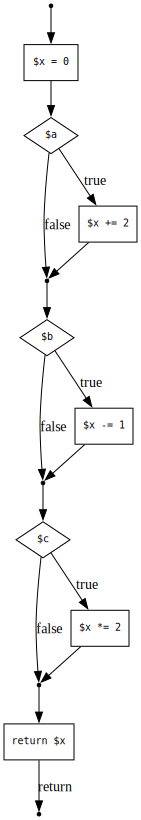
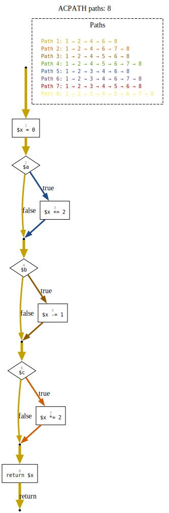
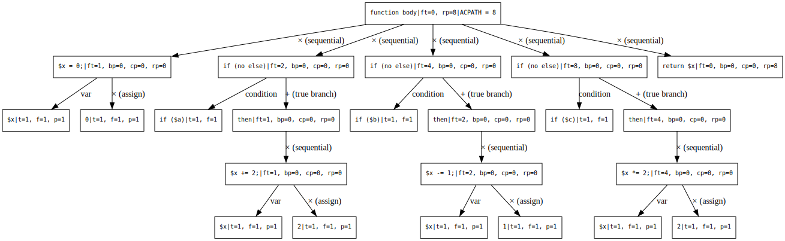

[](https://packagist.org/packages/sebastian/complexity)
[](https://github.com/sebastianbergmann/complexity/actions)
[](https://codecov.io/gh/sebastianbergmann/complexity)

# sebastian/complexity

Library for calculating the complexity of PHP code units.

## Installation

You can add this library as a local, per-project dependency to your project using [Composer](https://getcomposer.org/):

```
composer require sebastian/complexity
```

If you only need this library during development, for instance to run your project's test suite, then you should add it as a development-time dependency:

```
composer require --dev sebastian/complexity
```

## Cyclomatic Complexity

Cyclomatic Complexity measures the number of linearly independent paths through a function.
It is calculated by counting decision points and adding 1 for the default path.
A function with no branches has a Cyclomatic Complexity of 1; each additional decision point increases the value by 1.

The function `f()` shown below has a Cyclomatic Complexity of 4.

## Acyclic Execution Path (ACPATH)

This software metric counts the number of unique, non-looping execution paths through a function, in other words: the actual paths from entry to exit.

Sequential decisions multiply the path count: a function with three independent `if` statements has 2 × 2 × 2 = 8 paths.

Consider the following example:

```php
<?php declare(strict_types=1);
function f(bool $a, bool $b, bool $c): int
{
    $x = 0;

    if ($a) {
        $x += 2;
    }

    if ($b) {
        $x -= 1;
    }

    if ($c) {
        $x *= 2;
    }

    return $x;
}
```

This function has an ACPATH value of 8.

### Visualizations

The `acpath-dot` tool generates three [Graphviz](https://graphviz.org/) DOT files for each function:

```
./bin/acpath-dot f.php
```

#### Control Flow Graph

The control flow graph shows the structure of the code: statements (boxes), conditions (diamonds), and how control flows between them.
Dashed edges mark loop back-edges.



#### Path Enumeration

The path enumeration graph overlays all distinct entry-to-exit paths onto the control flow graph.
Each path is color-coded, and a legend lists the node sequence for each path.



#### Complexity Decomposition

The decomposition tree shows how the ACPATH value is calculated by recursively decomposing the function body.
Each node displays its metrics (ft, bp, cp, rp), and edges are labeled with composition operators:
`×` for sequential composition (one statement follows another, so path counts are multiplied),
`+` for branching (an `if`/`else` splits control flow, so path counts are added).

The four metrics track how paths exit each code unit:

- **ft** (fall-through paths): paths that complete the current statement and continue to the next one
- **bp** (break paths): paths that exit via a `break` statement (relevant inside loops and switch cases)
- **cp** (continue paths): paths that loop back via a `continue` statement
- **rp** (return paths): paths that exit the function via a `return` statement

The final ACPATH value is `ft + rp`: the sum of paths that fall through the entire function body and paths that exit early via `return`.



The ACPATH metric is described in [The ACPATH Metric: Precise Estimation of the Number of Acyclic Paths in C-like Languages](https://www.researchgate.net/profile/Patricia-Hill/publication/309425214_The_ACPATH_Metric_Precise_Estimation_of_the_Number_of_Acyclic_Paths_in_C-like_Languages/links/5866d1da08ae6eb871b0a91a/The-ACPATH-Metric-Precise-Estimation-of-the-Number-of-Acyclic-Paths-in-C-like-Languages.pdf) by Roberto Bagnara, Abramo Bagnara, Alessandro Benedetti, and Patricia Hill.
